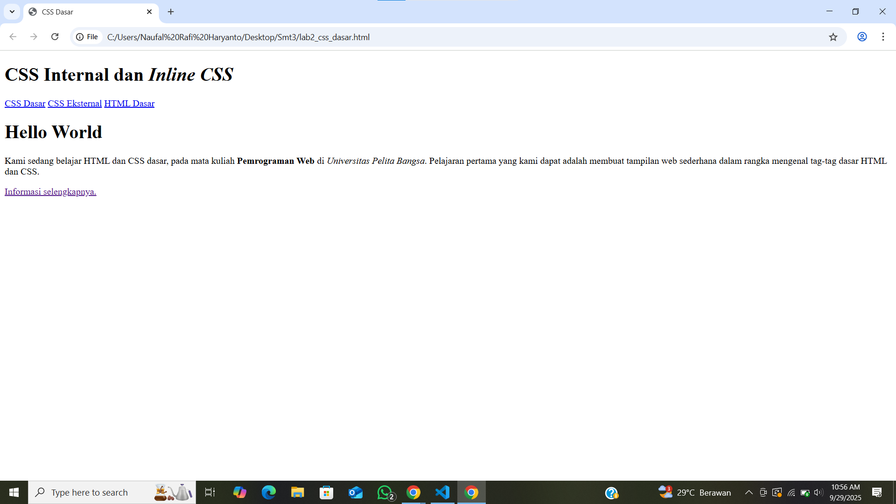
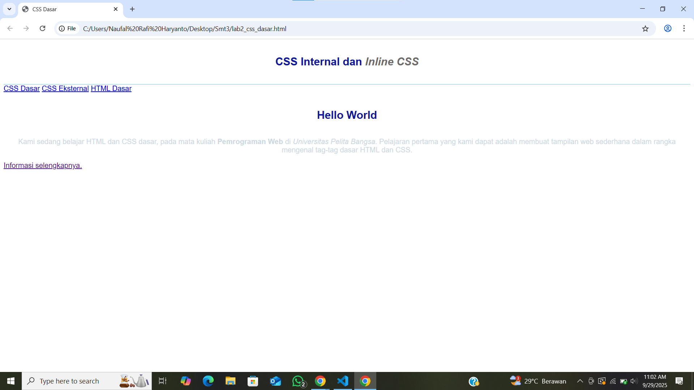

# Lab2web

Nama: Naufal Rafi Haryanto

Nim: 312410118

Kelas: TI.24.A1


## Praktikum 2: CSS Dasar

## Tujuan
1. Mahasiswa mampu memahami konsep dasar CSS.  
2. Mahasiswa mampu memahami aturan penulisan pada CSS.  
3. Mahasiswa mampu memahami selector sebagai pengontrol CSS.  
4. Mahasiswa mampu membuat pengaturan CSS pada HTML.  

---

## Pengantar
Cascading Style Sheet (CSS) digunakan untuk mengatur tampilan elemen-elemen HTML agar lebih terstruktur dan konsisten. CSS dapat ditulis dalam tiga cara:
- **Internal CSS** → ditulis di dalam tag `<style>` pada file HTML.  
- **Eksternal CSS** → ditulis di file `.css` terpisah dan dipanggil dengan `<link>`.  
- **Inline CSS** → ditulis langsung dalam atribut `style=""` pada elemen HTML.  

---

# Praktikum 2: CSS Dasar

## Tujuan
1. Mahasiswa mampu memahami konsep dasar CSS.  
2. Mahasiswa mampu memahami aturan penulisan pada CSS.  
3. Mahasiswa mampu memahami selector sebagai pengontrol CSS.  
4. Mahasiswa mampu membuat pengaturan CSS pada HTML.  

---

## Pengantar
Cascading Style Sheet (CSS) digunakan untuk mengatur tampilan elemen-elemen HTML agar lebih terstruktur dan konsisten. CSS dapat ditulis dalam tiga cara:
- **Internal CSS** → ditulis di dalam tag `<style>` pada file HTML.  
- **Eksternal CSS** → ditulis di file `.css` terpisah dan dipanggil dengan `<link>`.  
- **Inline CSS** → ditulis langsung dalam atribut `style=""` pada elemen HTML.  

---

## Langkah Praktikum

### 1. Membuat Dokumen HTML
Membuat file `lab2_css_dasar.html` dengan struktur dasar HTML.  

📸 **Screenshot Hasil:**  


---

### 2. Menambahkan CSS Internal
Menambahkan deklarasi internal CSS di dalam tag `<style>` pada bagian `<head>`.  

📸 **Screenshot Hasil:**  


---

### 3. Menambahkan Inline CSS
Menambahkan deklarasi CSS langsung pada elemen HTML.

Contoh:  

```html
<p style="text-align: center; color: #ccd8e4;">
  Kami sedang belajar HTML dan CSS dasar, pada mata kuliah <b>Pemrograman Web</b> 
  di <i>Universitas Pelita Bangsa</i>. Pelajaran pertama yang kami dapat adalah 
  membuat tampilan web sederhana dalam rangka mengenal tag-tag dasar HTML dan CSS.
</p>
```
# Praktikum 2: CSS Dasar

## Tujuan
1. Mahasiswa mampu memahami konsep dasar CSS.  
2. Mahasiswa mampu memahami aturan penulisan pada CSS.  
3. Mahasiswa mampu memahami selector sebagai pengontrol CSS.  
4. Mahasiswa mampu membuat pengaturan CSS pada HTML.  

---

## Pengantar
Cascading Style Sheet (CSS) digunakan untuk mengatur tampilan elemen-elemen HTML agar lebih terstruktur dan konsisten. CSS dapat ditulis dalam tiga cara:
- **Internal CSS** → ditulis di dalam tag `<style>` pada file HTML.  
- **Eksternal CSS** → ditulis di file `.css` terpisah dan dipanggil dengan `<link>`.  
- **Inline CSS** → ditulis langsung dalam atribut `style=""` pada elemen HTML.  

---

## Langkah Praktikum

### 1. Membuat Dokumen HTML
Membuat file `lab2_css_dasar.html` dengan struktur dasar HTML.  

📸 **Screenshot Hasil:**  


---

### 2. Menambahkan CSS Internal
Menambahkan deklarasi internal CSS di dalam tag `<style>` pada bagian `<head>`.  

📸 **Screenshot Hasil:**  


---

### 3. Menambahkan Inline CSS
Menambahkan deklarasi CSS langsung pada elemen HTML.  

Contoh:  

```html
<p style="text-align: center; color: #ccd8e4;">
  Kami sedang belajar HTML dan CSS dasar, pada mata kuliah <b>Pemrograman Web</b> 
  di <i>Universitas Pelita Bangsa</i>. Pelajaran pertama yang kami dapat adalah 
  membuat tampilan web sederhana dalam rangka mengenal tag-tag dasar HTML dan CSS.
</p>
````



## Jawaban Pertanyaan dan Tugas

### 1. Eksperimen dengan mengubah dan menambah properti CSS
Contoh perubahan kode CSS:

````css
body {
  font-family: 'Open Sans', sans-serif;
  background-color: #f0f8ff; /* menambahkan background */
}

h1 {
  font-size: 30px;   /* diubah dari 24px */
  color: darkblue;   /* diubah dari #0F189F */
  text-transform: uppercase; /* tambahan properti */
}

p {
  line-height: 1.8;  /* tambahan untuk jarak antar baris */
  color: #333333;    /* diubah dari default hitam */
}
````
### 2. Perbedaan h1 { ... } dengan #intro h1 { ... }
````
h1 { ... } → berlaku untuk semua elemen <h1> di halaman.

#intro h1 { ... } → hanya berlaku untuk <h1> yang berada di dalam elemen dengan id="intro".
````
Contoh:

````html
h1 {
  color: red;
}

#intro h1 {
  color: blue;
}

<h1>Judul Global</h1>
<div id="intro">
  <h1>Judul di dalam Intro</h1>
</div>
````
Hasil:
“Judul Global” berwarna merah

“Judul di dalam Intro” berwarna biru 

### 3. Internal, Eksternal, dan Inline CSS pada elemen yang sama

Urutan prioritas CSS:

Inline CSS (paling tinggi)

Internal CSS

Eksternal CSS

Contoh:
````html
<head>
  <link rel="stylesheet" href="style.css"> <!-- eksternal -->
  <style>
    p { color: green; }  /* internal */
  </style>
</head>
<body>
  <p style="color: red;">Teks Paragraf</p> <!-- inline -->
</body>
````
Hasil: paragraf akan berwarna merah, karena inline CSS lebih kuat daripada internal maupun eksternal.

### 4. Elemen dengan ID dan Class (spesifisitas selector)

ID (#id) lebih spesifik dibanding Class (.class).

Jika keduanya digunakan pada elemen yang sama, ID menang.

Contoh:
````css
#paragraf-1 {
  color: blue;
}

.text-paragraf {
  color: green;
}

<p id="paragraf-1" class="text-paragraf">
  Paragraf contoh
</p>
````
Hasil: teks berwarna biru, karena deklarasi ID lebih spesifik daripada class.

## Kesimpulan

CSS dapat ditulis secara internal, eksternal, dan inline.

Specificity menentukan aturan mana yang digunakan oleh browser.

Urutan prioritas: inline > internal > eksternal, dan ID selector lebih kuat dibanding class selector.

Dengan eksperimen properti CSS, tampilan web bisa dibuat lebih menarik, rapi, dan konsisten.
